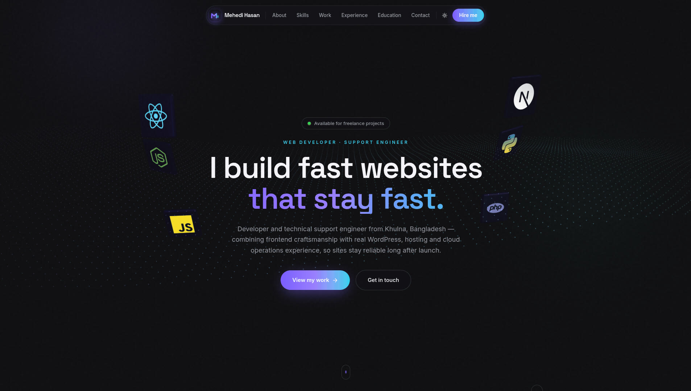
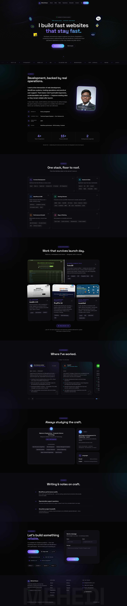

# Mehedi — Developer Portfolio 🚀

A modern, open-source developer portfolio with an interactive **Three.js hero**,
a premium **floating glass menu**, unique per-section designs, a real **SMTP
contact form**, full **SEO + AI-ready** metadata — deployable to **Vercel,
Netlify, Cloudflare, Render and Heroku** from a single repo.

<p align="center">
  
  
  
  
  
  
  
</p>



**Live demo → [mehedims.com](https://mehedims.com/)**
&nbsp;·&nbsp;
[](#-full-page-preview)

---

## 🖼️ Full Page Preview

Click to expand the complete page, top to bottom:

<details>
<summary><b>▶ Show full page (all sections)</b></summary>



</details>

## ✨ Features

- 🌌 **Interactive Three.js hero** — a particle wave field that ripples around
  the cursor, with floating 3D badges showing real tech logos (React,
  JavaScript, Next.js, Python, PHP, Node.js)
- 🧭 **Premium floating menu** — frosted-glass pill with a sliding active-section
  indicator (scroll-spy) and a mobile glass sheet
- 🎨 **Dark-first "Obsidian Aurora" design** with a polished light mode — one
  toggle, remembered
- 🧩 **Every section has its own style** — editorial About, HUD-bracket Skills
  bento, case-study Projects with real website screenshots, a **draggable
  experience carousel**, certificate-style Education, index-list Writing
- 🗂️ **"All work" browser** — full-screen popup with filter chips and a
  list + large-preview layout
- 📧 **Working contact form** — serverless SMTP email with honeypot spam
  trap, rate limiting, and inline success/error states (no mailto app)
- 🤖 **Email bot-protection** — the address is assembled at runtime, never
  present in the HTML or JS bundle
- 🔍 **Full SEO** — Open Graph + Twitter cards, JSON-LD Person/WebSite schema,
  canonical, sitemap.xml, robots.txt, generated OG share image
- 🤖 **AI-ready** — `llms.txt` for LLM crawlers, AI bots explicitly welcomed in
  robots.txt, semantic HTML landmarks throughout
- 🌍 **Any domain via one env var** — `VITE_SITE_URL` propagates to all SEO
  files and meta tags at build time
- 📄 **CV generator** — `scripts/generate-cv.mjs` writes a clean one-page PDF
  from your content
- ⚡ **Fast** — Three.js lazy-loaded as its own chunk, immutable asset caching
  configured on every platform

## 🚀 One-click deploy

| Platform | Button |
|---|---|
| Vercel | [](https://vercel.com/new/clone?repository-url=https%3A%2F%2Fgithub.com%2Fasma019%2FMehedi-Developer-Portfolio) |
| Netlify | [](https://app.netlify.com/start/deploy?repository=https%3A%2F%2Fgithub.com%2Fasma019%2FMehedi-Developer-Portfolio) |
| Render | [](https://dashboard.render.com/blueprints/new?repo=https%3A%2F%2Fgithub.com%2Fasma019%2FMehedi-Developer-Portfolio) |
| Heroku | [](https://heroku.com/deploy?template=https%3A%2F%2Fgithub.com%2Fasma019%2FMehedi-Developer-Portfolio) |

**Cloudflare (Workers):**

```bash
git clone https://github.com/asma019/Mehedi-Developer-Portfolio
cd Mehedi-Developer-Portfolio
npm ci && npm run build
npx wrangler deploy
```

Or connect the repo in the Cloudflare dashboard — build command
`npm run build`, deploy command `npx wrangler deploy` (the default).

> After deploying, set your env vars (site URL + SMTP or Resend) in the
> platform dashboard — see [DEPLOYMENT.md](DEPLOYMENT.md) for the full guide.

## 🛠️ Quick start

```bash
git clone https://github.com/asma019/Mehedi-Developer-Portfolio
cd Mehedi-Developer-Portfolio
npm install
cp .env.example .env   # then edit the values
npm run dev            # → http://localhost:5173
```

Production build + local server test:

```bash
npm run build
npm start              # → http://localhost:3000 (serves dist/ + /api/contact)
```

## ⚙️ Configuration

### 1. Your content — one file

Everything editable lives in **`src/data/content.ts`**: profile, hero copy,
skills, projects (with screenshots + gradients + links), experience, education,
socials. The CV, marquee and all sections read from it.

### 2. Environment — `.env`

| Variable | Purpose |
|---|---|
| `VITE_SITE_URL` | Canonical domain — injected into all SEO files/meta at build |
| `SMTP_HOST` `SMTP_PORT` `SMTP_USER` `SMTP_PASS` `SMTP_SECURE` | SMTP server for the contact form |
| `MAIL_FROM` / `MAIL_TO` | From header / inbox receiving messages |
| `RESEND_API_KEY` | Cloudflare only (Workers can't open SMTP sockets) — free at [resend.com](https://resend.com) |
| `PORT` | For `node server.js` (Render/Heroku) |

**Gmail example** — `SMTP_HOST=smtp.gmail.com`, `SMTP_PORT=587`,
`SMTP_SECURE=false`, `SMTP_PASS` = an [App Password](https://myaccount.google.com/apppasswords).

### 3. Make it yours

- **Domain** — `VITE_SITE_URL=https://yourdomain.com npm run build`
  regenerates sitemap, robots.txt, llms.txt and every meta tag
- **Logo** — replace `public/favicon.svg` (mark-only copy in `public/logo.svg`)
- **Screenshots** — drop into `public/screens/` and point each project's
  `shot` field at it (missing shots fall back to a gradient cover)
- **Company logos** — `public/logos/` + one line in `Experience.tsx`
- **Your photo** — replace `public/profile.webp`
- **CV** — edit content then `node scripts/generate-cv.mjs`
- **Colors/fonts** — CSS variables at the top of `src/index.css`

## 📁 Project structure

```
├── api/contact.ts              # Vercel function (/api/contact)
├── worker/index.ts             # Cloudflare Worker (static assets + /api/contact)
├── netlify/functions/          # Netlify function
├── server/                     # shared contact logic + SMTP/Resend senders
├── server.js                   # Node server (Render/Heroku): dist/ + API
├── public/                     # logo, CV, screenshots, og-image, _headers
├── scripts/generate-cv.mjs     # CV PDF generator
├── src/
│   ├── data/content.ts         # ★ ALL site content lives here
│   ├── components/             # Hero, FloatingMenu, sections, WorkModal…
│   │   └── three/HeroScene.tsx # Three.js particle wave + logo badges
│   └── index.css               # design system (Obsidian Aurora)
├── vercel.json · netlify.toml · wrangler.toml · render.yaml · Procfile
└── DEPLOYMENT.md               # per-platform deploy + SMTP guide
```

## 🤝 Contributing

Issues and pull requests are welcome! Fork it, make it yours, and if you
build something generally useful (a new section style, another platform
target, an extra sender) open a PR.

## 📄 License

Released under the [MIT License](LICENSE) — free to use, modify and deploy
for your own portfolio. A star ⭐ is appreciated!

---

Built with ❤️ by **Mehedi Hasan** · [mehedims.com](https://mehedims.com/)
· [GitHub](https://github.com/asma019) · [LinkedIn](https://www.linkedin.com/in/mehedims1/)
· [Upwork](https://upwork.com/freelancers/~01f39b319379efc4d6) · [Fiverr](https://www.fiverr.com/mehedims1)
